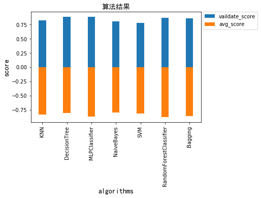

# soybean_classification
```
数据集:UCI的soybean数据集， 数据中包含缺失值
数据说明：给一个train和一个test
方法：决策树，random forest， bagging， boosting方法任选或组合，且不限于上述方法
要求：
a)要求有预处理步骤，包括数据特征选择，缺失值的填充
b)实现两种分类器，并给出交叉验证分类精度
c)需对比讨论预处理的效果，以及两种分类器的精度对比
d）讨论模型中参数的影响，给出参数的最佳取值范围
e）尝试分析算法存在的问题以及可能改进的方法
```
### 实现算法
1. KNN
2. DecisionTree
3. MLPClassifier
4. Naive Bayes
5. SVM
6. RandomForestClassifier
7. Bagging
### 效果图

